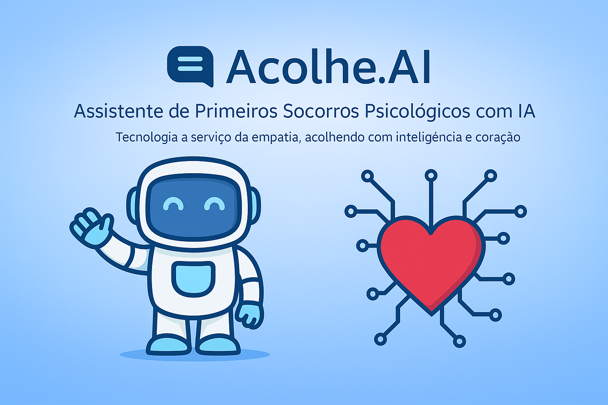
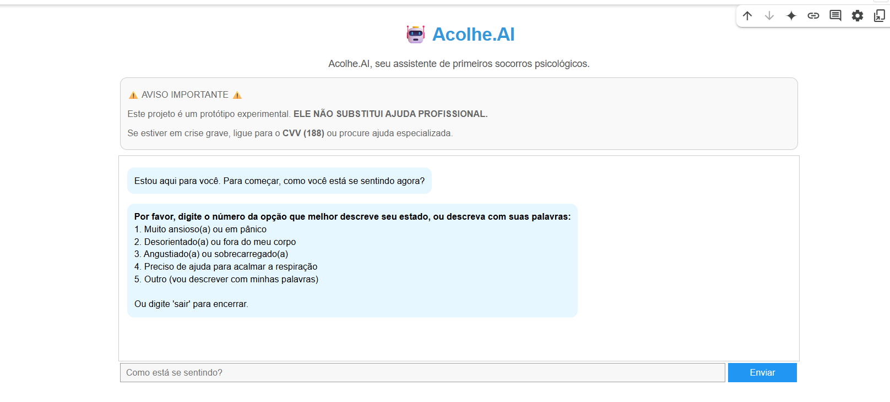

# 🤖 Acolhe.AI – Um Apoio Rápido em Momentos Difíceis

**Você já se sentiu sobrecarregado, ansioso ou perdido, e gostaria de alguém para conversar – sem julgamento, só acolhimento?**

O **Acolhe.AI** é um assistente empático baseado em IA que oferece **primeiros socorros psicológicos** em situações de estresse emocional. Ele conversa com linguagem suave, identifica sinais de ansiedade ou crise, e sugere técnicas simples como respiração guiada e ancoragem sensorial.

> ⚠️ Este projeto é experimental. **Não substitui apoio psicológico ou psiquiátrico profissional.** Em situações graves, procure o CVV (188) ou serviços de emergência.

---

## 🎯 Funcionalidades

- ✅ Conversa empática e acolhedora baseada em IA (Google Gemini).
- 🧘‍♀️ Técnicas guiadas: **respiração 4-4-6** e **ancoragem 5-4-3-2-1**.
- 🚨 Detecta palavras-chave de crise e oferece instruções de emergência.
- 📱 Interface intuitiva com visual limpo via `ipywidgets`.

---

## 👀 Como funciona na prática

1. O usuário informa como está se sentindo.
2. A IA responde com acolhimento, detecta situações sensíveis e propõe técnicas de manejo.
3. Em casos críticos, o Acolhe.AI interrompe a conversa e direciona para ajuda especializada.

---

## 🛠️ Tecnologias usadas

- Python + Google Gemini API
- Google Colab (interface interativa)
- ipywidgets para visual no notebook

---

## 🚀 Como testar

1. **Abra o notebook no Colab:**
   - `acolhe_ai.ipynb` → versão com interface interativa via widgets

2. **Gere sua chave no [Google AI Studio](https://aistudio.google.com/app/apikey)**

3. **Cole sua chave ao rodar o notebook** e comece a conversa.

---

## 📄 Considerações Éticas

O Acolhe.AI não coleta dados e não tenta substituir profissionais da saúde mental. Seu objetivo é oferecer apoio inicial e lembrar o usuário que **não está sozinho(a)**.

---

## 👨‍💻 Autor

Feito com 💙 por **Renan Vilar**  
Projeto criado durante a **Imersão IA Alura + Google (Maio/2025)**
